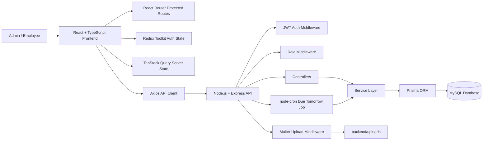
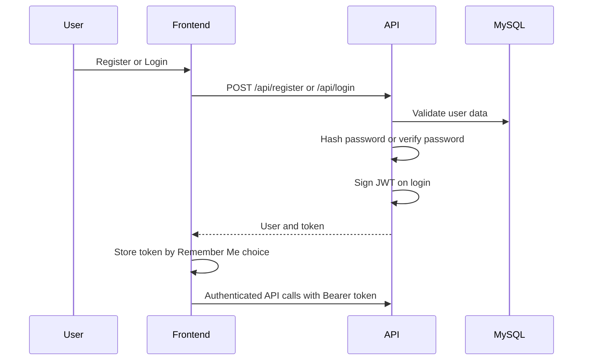
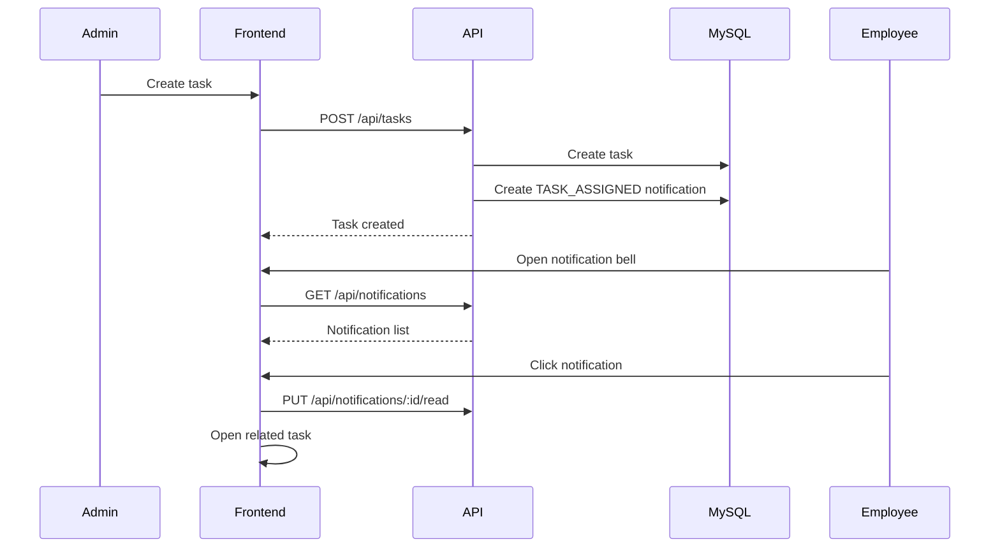
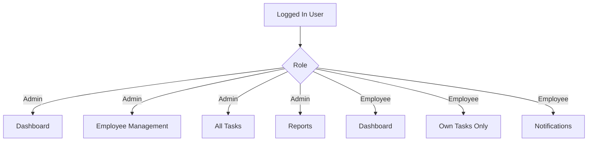
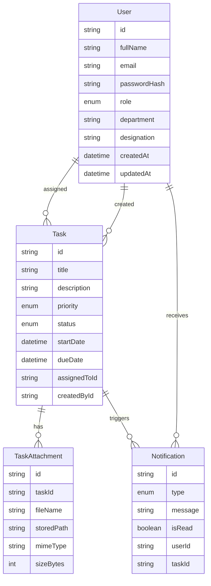

# Architecture and Flow Diagram

## System Architecture

```mermaid
flowchart LR
  User[Admin / Employee] --> Browser[React + TypeScript Frontend]
  Browser --> Router[React Router Protected Routes]
  Browser --> Redux[Redux Toolkit Auth State]
  Browser --> Query[TanStack Query Server State]
  Browser --> API[Axios API Client]

  API --> Express[Node.js + Express API]
  Express --> Auth[JWT Auth Middleware]
  Express --> Role[Role Middleware]
  Express --> Upload[Multer Upload Middleware]
  Express --> Controllers[Controllers]
  Controllers --> Services[Service Layer]
  Services --> Prisma[Prisma ORM]
  Prisma --> MySQL[(MySQL Database)]

  Express --> Cron[node-cron Due Tomorrow Job]
  Cron --> Services
  Upload --> Files[backend/uploads]
```

## Authentication Flow

```mermaid
sequenceDiagram
  participant User
  participant Frontend
  participant API
  participant DB as MySQL

  User->>Frontend: Register or Login
  Frontend->>API: POST /api/register or /api/login
  API->>DB: Validate user data
  API->>API: Hash password or verify password
  API->>API: Sign JWT on login
  API-->>Frontend: User and token
  Frontend->>Frontend: Store token by Remember Me choice
  Frontend->>API: Authenticated API calls with Bearer token
```

## Task and Notification Flow

```mermaid
sequenceDiagram
  participant Admin
  participant Frontend
  participant API
  participant DB as MySQL
  participant Employee

  Admin->>Frontend: Create task
  Frontend->>API: POST /api/tasks
  API->>DB: Create task
  API->>DB: Create TASK_ASSIGNED notification
  API-->>Frontend: Task created
  Employee->>Frontend: Open notification bell
  Frontend->>API: GET /api/notifications
  API-->>Frontend: Notification list
  Employee->>Frontend: Click notification
  Frontend->>API: PUT /api/notifications/:id/read
  Frontend->>Frontend: Open related task
```

## Role-Based Access

```mermaid
flowchart TD
  Login[Logged In User] --> Role{Role}
  Role -->|Admin| AdminDashboard[Dashboard]
  Role -->|Admin| Employees[Employee Management]
  Role -->|Admin| AllTasks[All Tasks]
  Role -->|Admin| Reports[Reports]
  Role -->|Employee| EmployeeDashboard[Dashboard]
  Role -->|Employee| MyTasks[Own Tasks Only]
  Role -->|Employee| Notifications[Notifications]
```

## Database ER Diagram

```mermaid
erDiagram
  User ||--o{ Task : assigned
  User ||--o{ Task : created
  User ||--o{ Notification : receives
  Task ||--o{ TaskAttachment : has
  Task ||--o{ Notification : triggers

  User {
    string id
    string fullName
    string email
    string passwordHash
    enum role
    string department
    string designation
    datetime createdAt
    datetime updatedAt
  }

  Task {
    string id
    string title
    string description
    enum priority
    enum status
    datetime startDate
    datetime dueDate
    string assignedToId
    string createdById
  }

  TaskAttachment {
    string id
    string taskId
    string fileName
    string storedPath
    string mimeType
    int sizeBytes
  }

  Notification {
    string id
    enum type
    string message
    boolean isRead
    string userId
    string taskId
  }
```
